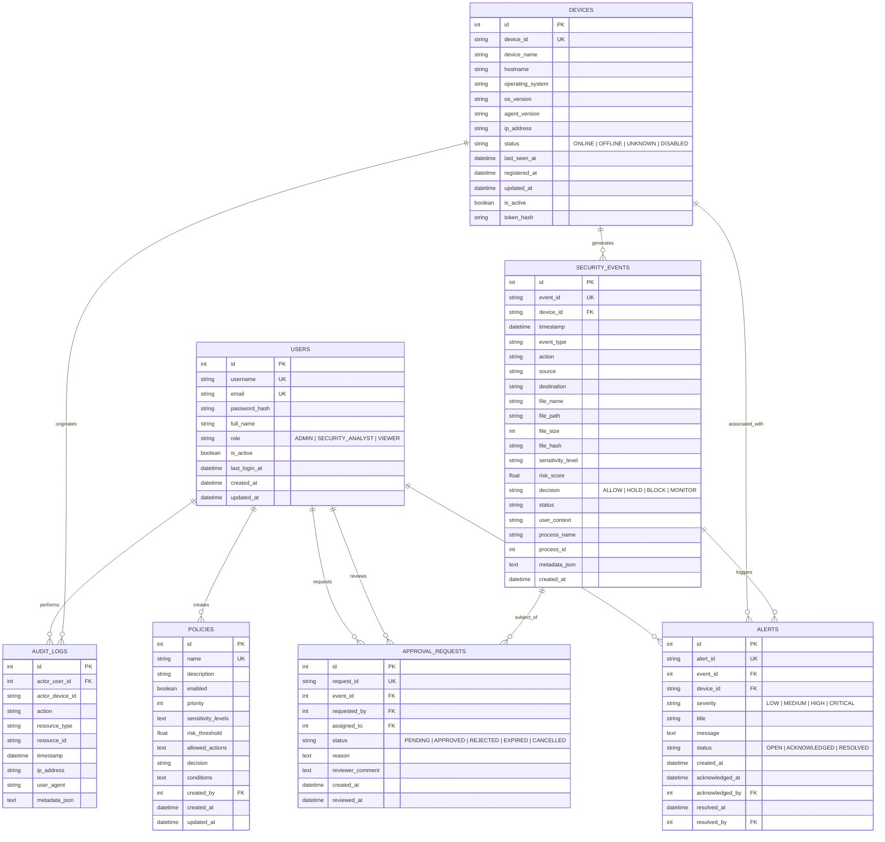

# SentinelX — Database Documentation

SentinelX utilizes an asynchronous/synchronous database architecture powered by **SQLAlchemy 2.x ORM** and **Alembic** migrations. It supports both **SQLite** (default for local development and unit tests) and **PostgreSQL** (for production / containerized deployments).

---

## Entity Relationship Overview

SentinelX models 7 core domain entities:



---

## Alembic Migration Workflow

Database schema evolution is managed via Alembic located under `backend/alembic/`.

### Migration Commands

Run migrations from the `backend/` directory:

```bash
# Upgrade database to latest revision
alembic upgrade head

# Rollback one revision
alembic downgrade -1

# Rollback to beginning
alembic downgrade base

# Create a new migration after model changes
alembic revision --autogenerate -m "describe changes"
```

### Seeding Development Data

To populate your database with realistic sample devices, policies, events, and alerts:

```bash
# From project root
python scripts/seed_dev.py
```
