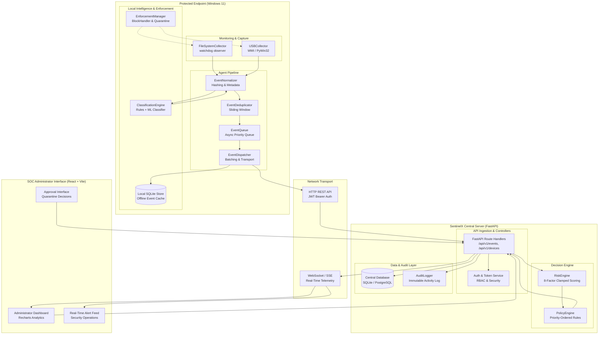
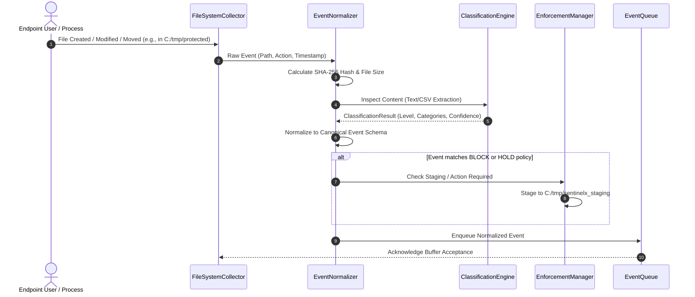
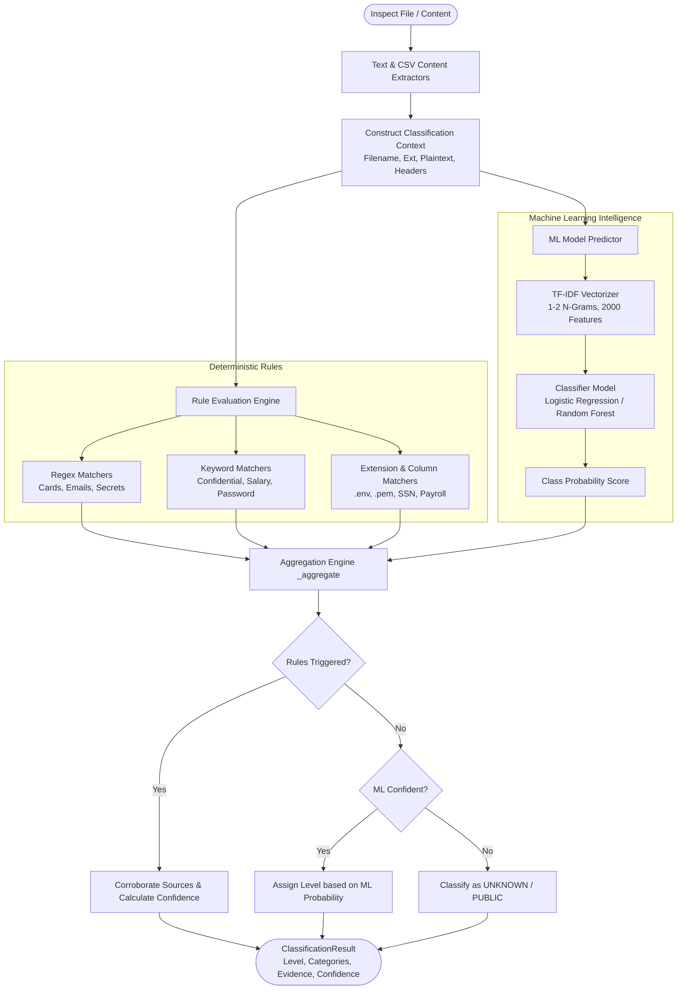
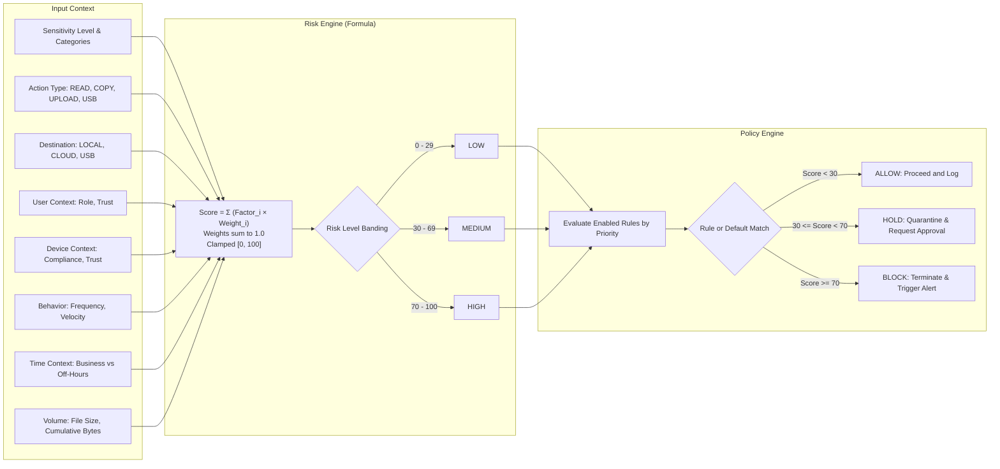
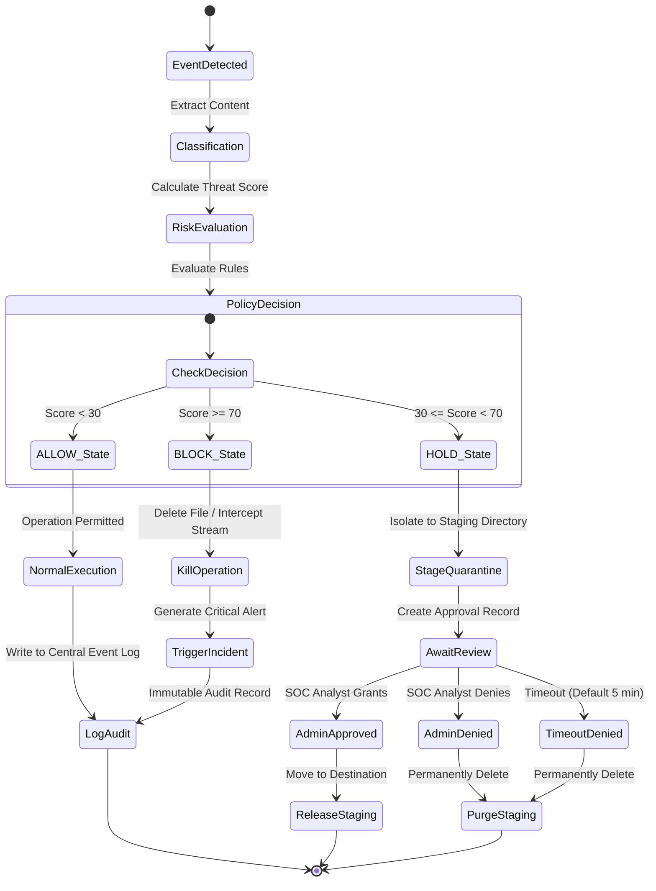
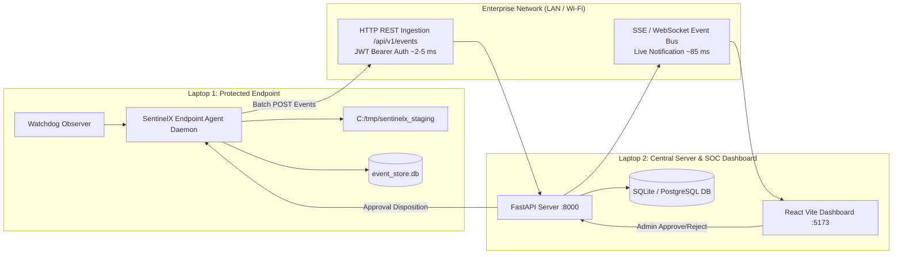
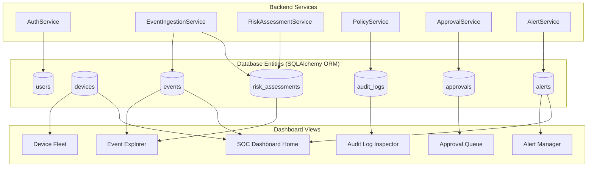
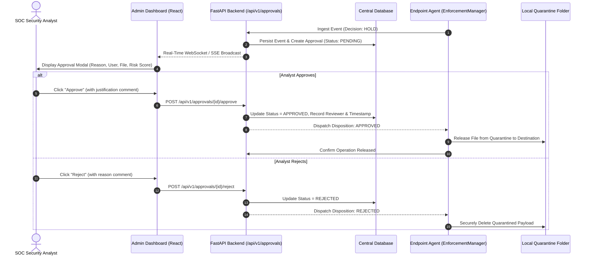
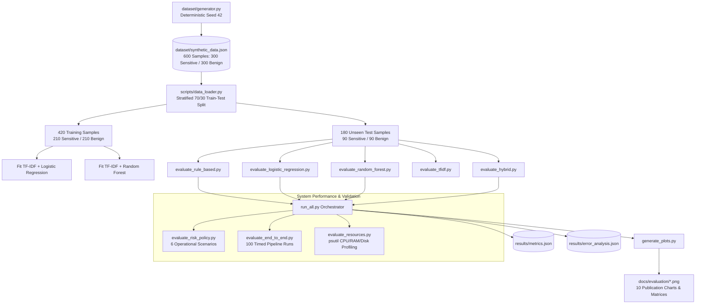

# SentinelX: System Architecture & Design Specification

**Document Version:** 1.0.0 (Final Delivery)  
**Classification:** Technical Documentation / Architectural Specification  

---

## 1. System Overview

SentinelX is an intelligent, enterprise-grade Data Loss Prevention (DLP) and Exfiltration Detection system designed to safeguard organizational data across Windows endpoints. It utilizes a distributed client-server architecture combining real-time filesystem and removable media monitoring, hybrid sensitive data classification (deterministic rules + TF-IDF machine learning), multi-factor risk assessment, proactive policy-driven enforcement, and an administrative SOC dashboard.

---

## 2. Overall SentinelX Architecture

---

## 3. Endpoint Monitoring Workflow

The endpoint monitoring subsystem operates concurrently using `watchdog` for filesystem events and polling/WMI for USB removable media.

---

## 4. Sensitive-Data Classification Workflow

SentinelX utilizes a **Hybrid Classification Pipeline** where deterministic rules evaluate high-entropy patterns (regex, keywords, headers) and a machine-learning model (TF-IDF vectorizer + Logistic Regression / Random Forest) provides semantic context scoring.

---

## 5. Risk Assessment & Policy Decision Workflow

Risk assessment is decoupled from policy enforcement: the Risk Engine calculates objective threat scores ($0 \le \text{Score} \le 100$), and the Policy Engine determines the enforcement action (`ALLOW`, `HOLD`, `BLOCK`).

---

## 6. ALLOW, HOLD, and BLOCK Enforcement Flow

---

## 7. Two-Laptop Communication Architecture

SentinelX is tested across a dual-laptop topology representing a real enterprise network:

---

## 8. Database and Dashboard Data Flow

---

## 9. Administrator Approval Workflow

---

## 10. Phase 9 Evaluation Methodology

The scientific evaluation architecture follows a strict reproducible pipeline:

